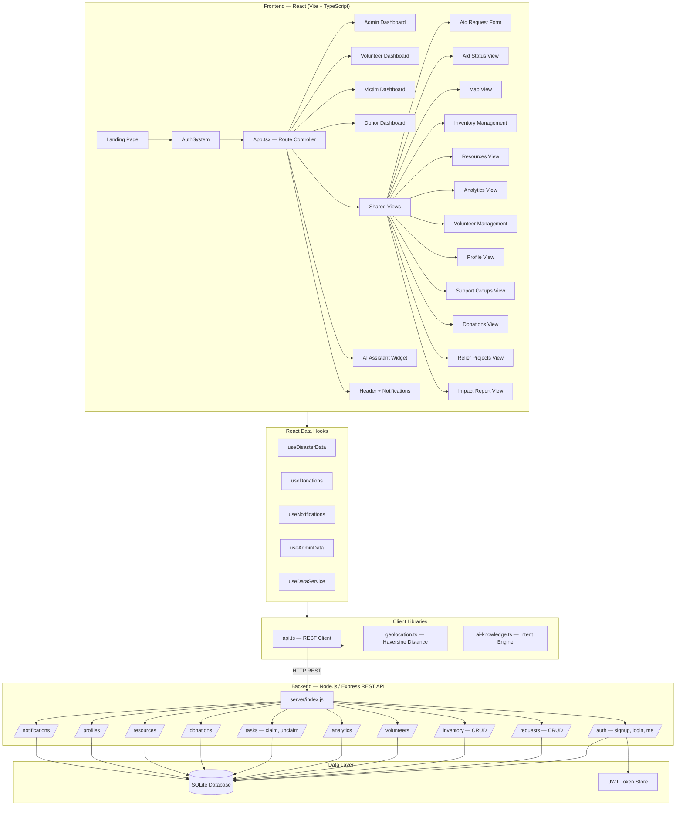

# Proposed System Architecture — DRRMS

> **Disaster Relief & Resource Management System**
> BITS Pilani Digital | v0.1.0

---

## System Overview

DRRMS is a **full-stack, role-based web application** designed to coordinate disaster relief operations among four distinct user groups: **Administrators, Volunteers, Victims, and Donors**. It provides real-time aid request tracking, inventory management, geolocation-based resource discovery, analytics, and an AI-powered assistant — all within a single unified portal.

| Property | Detail |
|---|---|
| **Frontend** | React 18 + TypeScript, Vite, TailwindCSS, shadcn/ui (Radix UI) |
| **Backend** | Node.js / Express (REST API), SQLite via `sqlite3` |
| **Auth** | JWT (jsonwebtoken) + bcryptjs for password hashing |
| **Charts** | Recharts |
| **Maps** | Browser Geolocation API + custom coordinate projection |
| **Notifications** | Sonner toast + polling-based notification system |
| **AI Assistant** | Rule-based intent matching (`ai-knowledge.ts`) |

---

## Architecture Diagram

---

## Module Descriptions

### 1. 🔐 Authentication & Authorization (`AuthSystem.tsx`, `api.ts /auth`)
- **Signup / Login** with email + password (bcryptjs hashing, JWT tokens)
- **4 Roles:** `admin`, `volunteer`, `victim`, `donor` — each sees a different dashboard and navigation set
- JWT stored in `localStorage`; validated on every API request via `Authorization: Bearer` header
- Session check on app load to restore logged-in state

---

### 2. 🖥️ Role-Based Dashboards
| Dashboard | Role | Key Features |
|---|---|---|
| `AdminDashboard` | admin | Live KPIs, pending requests, system health, quick-action buttons |
| `VolunteerDashboard` | volunteer | Available tasks, claimed tasks, task status updates |
| `VictimDashboard` | victim | Aid request status, nearby resources (geolocation), emergency actions |
| `DonorDashboard` | donor | Donation history, impact stats, relief project overview |

---

### 3. 🆘 Aid Request Management (`AidRequestForm`, `AidStatusView`)
- Victims submit requests: **category** (food, medical, shelter, emergency), **urgency** (1–5), **people count**, **GPS location**, **description**
- Requests stored with status lifecycle: `pending → in_progress → resolved | cancelled`
- AidStatusView polls every **15 seconds** for real-time updates

---

### 4. 📦 Inventory Management (`InventoryManagement.tsx`, `/inventory` API)
- Tracks: item name, category, quantity, unit, min threshold, location, status (`available / low_stock / out_of_stock / reserved`)
- Restock operations update quantity + auto-set status
- Add new items via modal overlay
- Filterable by category and status; search by name/location

---

### 5. 🗺️ Map View (`MapView.tsx`, `geolocation.ts`)
- Displays all active operations (volunteers, requests, resources, tasks) as markers on a coordinate-projected map canvas
- Uses **Haversine formula** to calculate distances between user GPS and resources
- Filter by type (volunteer, request, resource) or status (urgent, active)
- Marker detail panel shows lat/lng, status, actions (Navigate, Expedite for admin)

---

### 6. 📊 Analytics View (`AnalyticsView.tsx`, `/analytics` API)
- **KPIs:** Response rate, estimated response time, active resources, total donations
- **Charts:** Donation trend (AreaChart), request category distribution (PieChart), task status (BarChart) — powered by **Recharts**
- Data fetched from the backend's aggregation endpoint

---

### 7. 👥 Volunteer Management (`VolunteerManagement.tsx`, `AvailableTasksView`, `MyTasksView`)
- Admins see all registered volunteers, their availability, skills, and assigned tasks
- Volunteers browse available tasks → **Claim** → update to **In-Progress** → mark **Completed**
- Tasks auto-unlock (`unclaim`) if a volunteer releases a task

---

### 8. 💝 Donations Module (`DonationsView.tsx`, `useDonations.ts`)
- Donors submit monetary/supplies/services donations
- Stats: total amount, total donations, processed count, category/type breakdown
- People-helped estimate: `floor(totalAmount / 50) + supplies × 5`

---

### 9. 🏥 Resources & Support (`ResourcesView`, `SupportGroupsView`)
- **ResourcesView:** Lists emergency shelters, distribution centres; sortable by distance using Geolocation API
- **SupportGroupsView:** Community support groups (grief, trauma, family) — join and connect

---

### 10. 🤖 AI Assistant (`AIAssistant.tsx`, `ai-knowledge.ts`)
- Floating chatbot widget available on all authenticated views
- **Intent engine:** keyword scoring + context/role filtering against a knowledge base
- Can navigate the app (`navigate` action), trigger calls (`call` action), or provide guidance
- Intents include: emergency, shelter, donations, support groups, greetings

---

### 11. 🔔 Notifications (`useNotifications.ts`, `/notifications` API)
- Bell icon in header with unread count badge
- **Polling every 10 seconds** (no WebSocket — REST-based)
- Mark individual or all as read; optimistic UI update

---

### 12. ⚙️ Backend REST API (Node.js / Express + SQLite)
| Route | Methods | Purpose |
|---|---|---|
| `/api/auth` | POST signup/login, GET me | Authentication |
| `/api/requests` | GET, POST, PATCH | Aid request CRUD |
| `/api/inventory` | GET, POST, PATCH | Inventory CRUD |
| `/api/tasks` | GET, PATCH, POST claim/unclaim | Volunteer task management |
| `/api/volunteers` | GET | Volunteer directory |
| `/api/donations` | GET, POST | Donation records |
| `/api/resources` | GET, POST, PUT, DELETE | Relief resource centres |
| `/api/profiles` | GET, PUT | User profile management |
| `/api/notifications` | GET, PATCH read/read-all | Notification management |
| `/api/analytics` | GET | Aggregated metrics |
